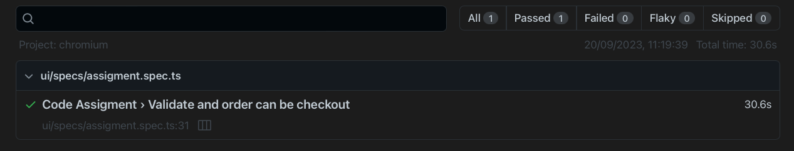
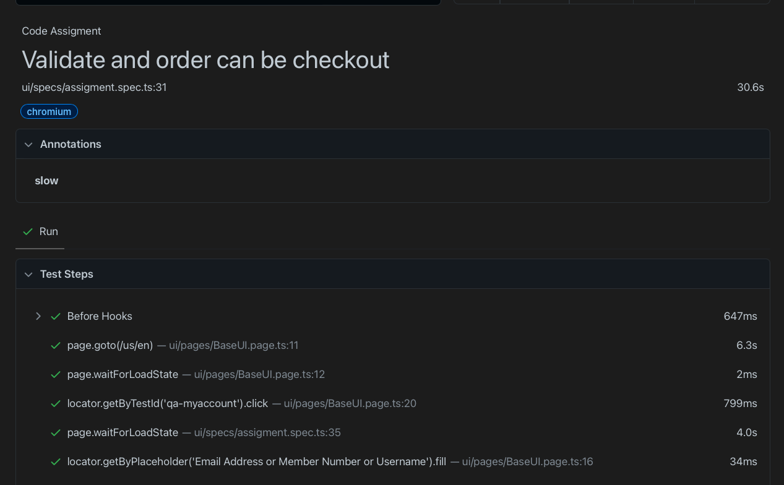
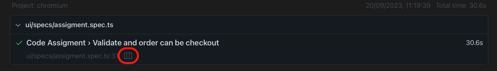
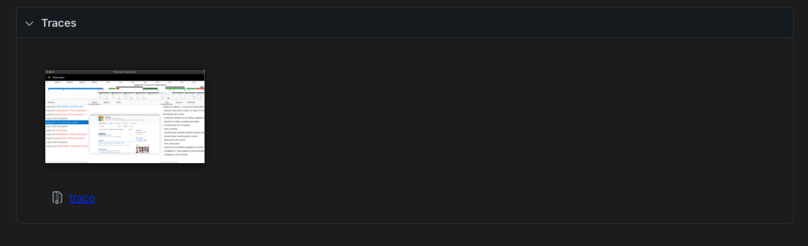

# Tech9 -Automation-Challenge

This is my resolution of the Tech9 coding assigment using Typescript & Playwright

## Requirements

Install [NodeJs](https://nodejs.org/en)

Check node version from terminal

```bash
  $ node --version
    v18.17.0
```

Install [Visual Studio Code](https://code.visualstudio.com/)

Clone the respository

```sh
git clone git@github.com:Hung9762/tech9-assigment.git
```

Open the repository with VS code and go to terminal

```sh
$ npm install
added 5 packages, and audited 6 packages in 832ms

1 package is looking for funding
  run `npm fund` for details

found 0 vulnerabilities
```

## Running Tests from npm commands

When running the test cases, the headless mode is turn off

```bash
$  npx playwright test --headed
```

## Tests results

- Afte a run is finish, a command to open the report should be printed in the terminal

```bash
$  npx playwright show-report
```

## HTML Report Structure

- The report generated



- Select the test case, to display the full test steps per test case



- A video is available per test case, the video can be access by tapping the icon



- And by scrolling down inside each test case



## FAQ

#### What happens if the test are not running?

Verify all the dependencies are installed, use the following command

```bash
  npm install
```

## Authors

- [@hung9762](https://github.com/Hung9762)
